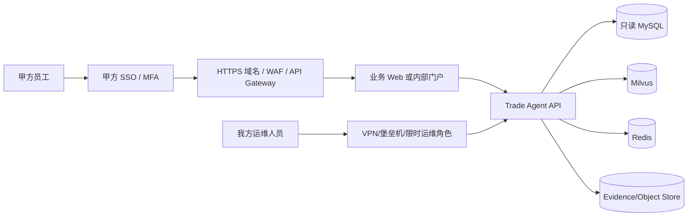
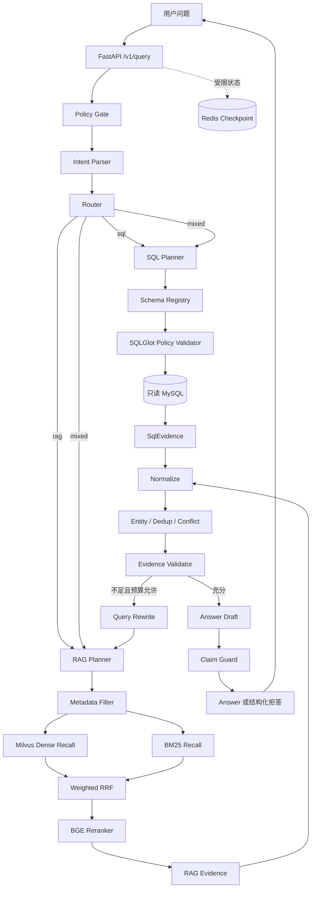

# 外贸情报智能体：从甲方交付、业务问题、RAG 到 Agent 的完整项目复盘

> 本文是我的项目复盘与面试讲解稿。它按照“项目怎样交付和运维 → 甲方为什么需要 → 数据怎样进入系统 → RAG 怎样检索 → Agent 怎样决策 → 如何验收”的顺序展开，并把关键实现定位到具体文件、类、函数和代码段。
>
> **使用说明：**第 0 节是一套“匿名甲方私有化交付”的完整情境化讲法，用来帮助我按照真实 ToB 项目的结构复盘。只有当客户类型、部署方式、上线状态、用户量和 SLA 与我的真实经历一致时，才能把其中的占位项替换后作为事实陈述。当前 Git 仓库本身能够证明的是合成数据上的工程实现和测试/评测记录，不能单独证明存在真实甲方或系统已经投产。

---

## 0. 先讲项目是怎样卖、怎样部署、谁来维护的

### 0.1 推荐采用的甲方项目背景口径

这个项目按**匿名外贸企业的单租户私有化情报平台**来复盘。甲方可以设定为一家有稳定海外业务、拥有内部订单/客户资料，同时需要持续跟踪海关、企业官网、B2B 平台、监管公告和行业新闻的制造或贸易企业。

面试叙述时先交代五个事实字段，不能含糊：

| 字段 | 应当怎样说 | 当前必须补齐的内容 |
|---|---|---|
| 甲方类型 | 某制造/贸易集团，名称因保密协议匿名 | `[行业与规模]` |
| 业务用户 | 海外销售、市场研究、风控或管理层 | `[真实角色与人数]` |
| 上线阶段 | PoC、试运行、正式生产三选一 | `[真实阶段与日期]` |
| 部署区域 | 甲方自有云账号/VPC 或本地机房 | `[真实云厂商、Region]` |
| 服务指标 | 可用性、恢复时间、响应时间 | `[合同或实际指标；没有就不要编]` |

一段完整的开场可以这样组织：

> 这是我们为一家匿名外贸企业建设的单租户情报 Agent。甲方原来由销售和研究人员手工在海关数据、企业官网、B2B 页面、新闻和 PDF 公告之间交叉核验，查一个潜在客户耗时较长，且结论无法统一追溯。项目部署在甲方控制的云账号和专属 VPC 中，业务数据不离开甲方安全边界；我们交付应用、模型与数据流水线，并通过受审计的运维角色持续发布和维护。甲方员工只通过企业身份登录 Web/API，不直接接触数据库和服务器。我主要负责 RAG 数据契约、混合检索、评测闭环，以及将 SQL/RAG 分支接入 LangGraph Agent。

这段话里的“正式生产”“耗时”“用户量”和客户行业必须有真实依据后才能补充数字。

### 0.2 为什么选择“甲方自有云 + 单租户私有化 + 我方持续运维”

本项目不采用“把一台服务器卖给甲方后彻底移交”，也不采用所有客户共享数据库的普通多租户 SaaS。选择如下模式：

```text
甲方购买/持有：云账号、VPC、计算、磁盘、备份、域名和数据控制权
我方授权/交付：应用代码制品、容器镜像、模型配置、索引与部署脚本
甲方日常使用：企业账号登录 Web/API，按角色访问自己的情报数据
我方持续服务：版本升级、数据源维护、模型与检索调优、故障响应、月度报告
合同关系：首次实施费 + 软件许可/订阅费 + 年度运维服务费 + 云资源由甲方承担
退出机制：撤销我方运维角色，甲方保留数据、备份、配置和约定版本的软件制品
```

这样安排的业务理由是：

1. 甲方的订单、客户主数据和线索属于敏感商业数据，数据控制权应在甲方；
2. 单租户资源边界更容易向法务、安全和 IT 解释，也便于定制数据源；
3. 甲方通常不希望自己维护 Embedding、Milvus、解析器和 Agent 工作流，我方持续运维能保证迭代；
4. 基础设施由甲方持有，合作终止时不会出现数据被供应商“锁死”的问题；
5. 我方运维通过最小权限、限时授权、堡垒机/VPN 和审计日志进入，而不是共享管理员密码。

这是一个适合敏感企业数据的交付选择，不是所有 ToB 软件唯一的“行业标准”。官方云架构资料也把 account/VPC full-stack silo 作为隔离方案，并指出它以更高运维复杂度换取更清晰的租户边界；托管运维则通常采用甲乙双方共同负责的 RACI 模式。参考：[AWS Full stack isolation](https://docs.aws.amazon.com/whitepapers/latest/saas-tenant-isolation-strategies/full-stack-isolation.html)、[AWS ADM operating model](https://docs.aws.amazon.com/prescriptive-guidance/latest/strategy-transform-adm-operating-model-gen-ai/adm-op-model.html)。

### 0.3 交付边界：我们交付什么，不交付什么

#### 我方交付

- 外贸情报 Agent 的后端服务、API 契约和容器镜像；
- MySQL 表结构、迁移脚本、只读查询账户策略；
- 多源采集、解析、分块、隔离和索引流水线；
- BGE-M3、BM25、Milvus、RRF、reranker 检索链路；
- LangGraph SQL/RAG/mixed 工作流、Redis checkpoint 和 Evidence Store；
- 评测集结构、回归门禁、部署脚本、运维手册和故障预案；
- 约定期内的数据源适配、版本升级、Bug 修复和性能调优。

#### 甲方负责

- 云账号、网络、域名、证书、预算审批和资源账单；
- 提供有合法使用权的内部数据与外部数据源授权；
- 企业身份系统、业务账号审批和人员离职回收；
- 确认数据分级、保存周期、地域限制和合规要求；
- 指定业务 Owner、IT Owner、安全联系人和验收负责人；
- 对 Agent 输出做业务决策，系统不替代甲方的最终审查责任。

#### 共同负责

- 数据源变更和采集异常处理；
- 安全事件响应；
- 业务词表、企业别名和 HS 映射维护；
- 发布窗口、回滚和重大版本验收；
- 指标阈值、拒答策略和来源权威性规则调整。

这类责任划分应该在项目初期形成 RACI 表。云环境本身也遵循共享责任：云厂商保护云基础设施，客户和应用运维方仍需负责数据、身份、网络配置、系统与应用安全。参考 [AWS Shared Responsibility Model](https://docs.aws.amazon.com/whitepapers/latest/aws-risk-and-compliance/shared-responsibility-model.html)。

### 0.4 数据怎样进入、保存和退出系统

生产叙述必须把“数据”拆成四层，而不是笼统地说爬虫数据：

| 数据层 | 例子 | 获取方式 | 保存位置 | 关键控制 |
|---|---|---|---|---|
| 甲方内部结构化数据 | 客户、订单、产品、成交、业务员归属 | 只读数据库视图或 SFTP/API 增量 | 甲方 MySQL 私有子网 | 字段白名单、脱敏、最小权限 |
| 合法授权外部结构化数据 | 海关衍生记录、企业注册、HS 目录 | 授权 API、定期文件 | 原始区 + 标准事实表 | 许可登记、批次哈希、可追溯 |
| 公开/授权非结构化数据 | 官网、公告、新闻、B2B、PDF | 合规采集器或供应商 API | 对象存储/文档区 + chunk 索引 | robots/许可、限速、来源 URL、采集时间 |
| 系统派生数据 | chunk、embedding、BM25、Evidence、trace | 流水线生成 | Milvus、BM25 bundle、Evidence Store | build ID、哈希、TTL、不可变版本 |

数据生命周期建议按以下顺序讲：

```text
来源登记 → 拉取原始文件 → 恶意文件/格式检查 → 解析 → 标准化
→ PII/敏感字段处理 → 文档与 chunk 哈希 → quarantine/通过
→ BM25 与 Milvus 同 build 构建 → 评测 → 发布 → 到期删除或归档
```

每条来源需要记录许可证或合同依据、负责人、采集频率、数据地域和保留期限。数据删除不能只删 MySQL 行，还要删除对象、chunk、向量、稀疏索引、checkpoint 和备份中的对应生命周期版本。

当前仓库能直接对应这些安排的实现包括：

- 来源、文档与 chunk 合同：[trade_agent/schemas/source.py](trade_agent/schemas/source.py#L190-L338)；
- 来源 catalog、manifest、quarantine 与原子发布：[trade_agent/data/pipeline.py](trade_agent/data/pipeline.py#L53-L263)；
- 七表关系结构：[db/migrations/001_schema.sql](db/migrations/001_schema.sql#L1-L113)；
- Milvus 与 BM25 build 一致性：[trade_agent/index/builder.py](trade_agent/index/builder.py#L22-L127)；
- Redis checkpoint 字段和 TTL 限制：[trade_agent/agents/checkpoint.py](trade_agent/agents/checkpoint.py#L175-L335)。

仓库目前**没有**可证明真实客户 IAM、对象存储生命周期、WAF、备份任务和监控平台已经配置的 IaC，因此这些只能作为生产交付设计，不能谎称已由代码验证。

### 0.5 服务怎样提供给甲方员工

业务员工不获取服务器 SSH，也不直接访问 MySQL、Milvus 或 Redis。正常访问链路应当是：



建议角色至少分为：

| 角色 | 权限 |
|---|---|
| 业务查询用户 | 发起问题、查看自己有权限的数据与引用 |
| 业务管理员 | 配置业务词表、查看团队使用与反馈 |
| 数据管理员 | 管理来源、批次、quarantine 和重建索引 |
| 审计员 | 只读查看访问、发布、配置和证据日志 |
| 平台运维 | 健康检查、发布、回滚；默认不能查看业务正文 |

当前代码提供 FastAPI、`/healthz`、`/readyz`、query、retrieve、run/resume 和 evidence 接口，但**没有实现完整企业 SSO、Web 前端和多角色 RBAC**。真实交付时应由 API Gateway/企业 IdP 和应用授权层补齐，不能把接口存在等同于账号体系已经完成。

### 0.6 生产部署拓扑怎样安排

仓库中的 [docker-compose.yml](docker-compose.yml#L1-L108) 是单机演示和集成验证拓扑，不应直接描述成高可用生产集群。面试里的生产方案可以按下面两档说明：

#### 首期/中小规模单租户

- 甲方专属 VPC，公网只暴露 HTTPS 网关；
- API 容器至少两个副本，由负载均衡分发；
- MySQL 使用云托管数据库或主备实例；
- Milvus 使用独立节点/托管服务，并把 etcd、对象存储放在私有子网；
- Redis 使用带持久化和故障转移的托管实例；
- 原始文档和 Evidence 使用对象存储，开启版本和生命周期；
- 模型文件从经过哈希校验的内部制品库加载；
- 日志、指标和告警进入甲方监控平台；
- 每日增量备份、定期全量备份和恢复演练。

#### 数据量和并发增长后

- API、采集 worker、索引 worker 分离扩缩容；
- 在线 query 与离线 ingest 使用不同队列和资源池；
- Milvus 按 collection/partition 与资源组规划；
- 蓝绿或金丝雀发布，索引采用新 build 构建完成后原子切换；
- 读写路径、管理路径与运维路径使用独立网络和身份；
- 跨可用区部署，并根据合同确定是否跨区域灾备。

项目中的 `build_id`、冻结 bundle 和 readiness 检查为“先构建、验证，再切换”的发布方式提供了代码基础，但多副本编排、负载均衡和跨区容灾仍需要额外 IaC。

### 0.7 发布、维护和故障响应

一次标准发布应包含：

1. 在测试环境生成语料 build，运行 unit/contract/security/evaluation；
2. 镜像和模型制品生成不可变版本、SBOM 与校验和；
3. 在预生产环境连接真实 MySQL/Milvus/Redis 做 smoke；
4. 业务 Owner 验收固定 query set；
5. 在发布窗口部署新 API，并加载新索引 build；
6. `/readyz` 通过后逐步切流；
7. 观察错误率、P95、拒答率、检索降级率和资源水位；
8. 异常时把流量和 build 指针回滚到上一版本；
9. 形成变更记录和月度服务报告。

故障责任可按以下方式拆分：

| 故障 | 第一响应 | 处理方式 |
|---|---|---|
| 云主机/网络/磁盘故障 | 甲方 IT + 云厂商，我方协查 | 基础设施工单、切换实例 |
| API/Agent 版本故障 | 我方 | 回滚镜像、关闭有问题功能 |
| 数据源格式变化 | 我方数据/RAG 维护 | quarantine、更新 parser、回放批次 |
| 甲方内部数据错误 | 甲方数据 Owner | 修复源数据后重跑受影响 build |
| 模型或检索质量回退 | 我方 + 业务 Owner | 配对评测，未过门禁不发布 |
| 凭据泄漏/越权 | 双方安全负责人 | 立即吊销、审计、按预案响应 |

SLA 数字必须以合同为准。没有真实合同证据时，用“按 P1/P2/P3 分级响应，具体时限见 SLA”即可，不要随意声称 `99.9%` 或“15 分钟恢复”。

### 0.8 项目从售前到在用的生命周期

如果确实是已经在使用的真实项目，应当能讲清每个阶段的证据：

| 阶段 | 主要产物 | 能证明进入下一阶段的材料 |
|---|---|---|
| 需求调研 | 业务问题清单、数据源清单、权限边界 | 需求确认记录 |
| PoC | 合成/脱敏样本、检索 baseline、原型 API | PoC 验收单 |
| 试点 | 真实授权数据、固定用户组、反馈闭环 | 试运行记录、问题单 |
| 生产验收 | 生产部署、备份恢复、权限和安全检查 | 上线单、验收报告 |
| 持续运维 | 月报、告警、发布、数据源维护 | 工单、发布记录、服务报告 |

当前仓库提供的是代码、自动化测试、合成评测和运维文档证据。若没有上线单、真实监控、账号审批和运维工单，就应把项目阶段说成“完成工程交付/试点验证”，而不是“已稳定生产运行”。

---

## 1. 一句话定义这个项目

这是一个**证据优先的外贸情报 Agent**：用户用自然语言询问某个国家、企业、HS 编码、时间段或市场信号，系统把问题拆成结构化 SQL 查询和非结构化 RAG 检索，合并并校验证据，再输出每条结论都能定位来源的答案；如果证据不足或冲突严重，系统会拒答，而不是让大模型自由发挥。

我在项目中承担的核心工作，可以归纳为四条主线：

1. 把外贸业务问题转化为稳定的数据字段、查询意图和证据要求；
2. 建立从多源文档解析、分块、索引，到混合召回、融合、重排、去重的 RAG 链路；
3. 将 SQL 和 RAG 两类工具接入 LangGraph Agent，并加入状态管理、预算、重试、证据校验和 Claim 级防幻觉；
4. 建立公开开发集、私有留出集、泄漏检查、不可变报告和仓库审计，让优化有可复核的依据。

如果面试官只给 30 秒，我会这样介绍：

> 我做的是一个外贸情报 Agent。业务上的难点是海关交易数据适合 SQL，但企业新闻、B2B 页面、监管公告和 PDF 又必须靠 RAG；而外贸决策对国家、HS 编码、时间、金额单位和来源可信度非常敏感。我设计了统一元数据和证据模型，用 BM25 与 BGE-M3 稠密检索做混合召回，以加权 RRF 融合，再用 BGE reranker 重排；之后把 SQL 与 RAG 作为两条受控分支接入 LangGraph。生成前做证据充分性检查，生成后逐条检查 Claim 与证据的实体、时间、粒度和数值是否一致。公开开发集上，明确自然月过滤把上下文精确率从 0.075231 提升到 0.194907，同时 Recall@10 保持 0.472222。这里的指标来自合成语料和本地评测适配器，我不会把它描述成生产效果。

---

## 2. 从业务问题出发，而不是从模型出发

### 2.1 用户真正想解决什么

外贸业务人员通常不会说“请做向量检索”。他们会问：

- 某个 HS 编码在某国最近几个月有哪些活跃进口商？
- 某家公司是否真的在经营目标品类，近期交易趋势怎样？
- 哪些潜在客户既有交易记录，又出现了扩产、招聘、融资或采购信号？
- 某条市场消息来自官网、监管机构、新闻转载还是社交媒体？
- 两个来源说法冲突时，哪个更可信？
- 数据不足时，系统能否明确说“不足以判断”？

这些问题同时包含三类需求：

| 业务需求 | 最适合的数据形态 | 系统处理方式 |
|---|---|---|
| 金额、数量、排名、趋势、交易日期 | 结构化关系数据 | 只读 MySQL + 受限 SQL |
| 新闻、公告、网页、PDF、B2B 商品描述 | 非结构化文本 | RAG 混合检索 |
| “交易活跃且最近有扩产信号” | 结构化与非结构化联合 | Agent 并行调用 SQL 与 RAG，再合并证据 |

因此技术方案不能只有一个向量库。只做 RAG 会让精确聚合、时间范围和金额计算失去确定性；只做 SQL 又无法覆盖网页、PDF 和叙述性市场信号。项目最终采用 **SQL + RAG + Agent** 的组合。

### 2.2 业务约束如何决定系统约束

外贸情报有几个容易被忽略的风险，它们直接决定了代码设计：

1. **同名企业风险。**同一个英文名可能属于不同国家的企业，同一家企业也可能有缩写、别名和域名差异。因此企业不能只靠字符串等值匹配。
2. **HS 编码层级风险。**两位、四位、六位 HS 编码代表的粒度不同。系统必须保留原始 HS 编码和查询粒度。
3. **时间口径风险。**“2025 年 6 月”不能被模糊成最近 30 天；交易日期、发布时间、有效期和采集时间也不是同一个字段。
4. **金额与单位风险。**USD 金额、原币金额、重量和件数不能混算；聚合结果必须携带货币、单位和聚合粒度。
5. **转载污染风险。**十家网站转载同一条新闻，不等于十个独立来源。
6. **来源权威性风险。**监管公告、企业官网、新闻、B2B 页面和社交帖子不能拥有相同的先验可信度。
7. **生成幻觉风险。**即使检索命中了相关文档，生成模型也可能把不同实体、时间或数值拼接成一句貌似合理的话。

这些约束对应了项目里的字段、过滤器、来源先验、去重聚类、冲突仲裁、证据校验和 Claim Guard，而不是停留在提示词里。

### 2.3 业务问题到执行路径的映射

| 用户问题 | 路由 | 原因 | 典型证据 |
|---|---|---|---|
| “2025 年德国 HS850440 前十进口商” | SQL | 需要筛选、聚合、排序、Top N | 行级查询与聚合结果 |
| “这家公司最近有没有扩产信号” | RAG | 信号存在于新闻、官网或公告文本 | 带 URL、发布时间、文本定位的 chunk |
| “找出交易活跃且近期扩产的潜客” | mixed | 交易活跃来自 SQL，扩产来自 RAG | 两分支证据合并 |
| “告诉我未来一定会下单的客户” | refusal/受限回答 | 证据无法支持确定性预测 | 结构化拒答原因 |

这个映射由 [trade_agent/agents/router.py](trade_agent/agents/router.py#L11-L54) 的确定性路由实现，意图字段由 [trade_agent/agents/intent.py](trade_agent/agents/intent.py#L210-L333) 解析并转成检索约束。

---

## 3. 总体架构



基础设施由 [docker-compose.yml](docker-compose.yml#L1-L108) 编排：MySQL 保存结构化交易数据，Milvus 保存稠密向量，etcd 和 MinIO 支撑 Milvus，Redis 保存 Agent 检查点，FastAPI 暴露查询接口。

这里最重要的架构原则是：**模型只能提出候选，确定性代码负责约束、验证和最终放行。**

---

## 4. 技术选型及其业务理由

### 4.1 为什么选 Python、Pydantic 和 FastAPI

- **Python 3.12**：RAG、Embedding、Milvus、LangGraph 和评测生态完整，适合快速实现多阶段数据流水线。
- **Pydantic v2**：项目里大量对象跨越采集、索引、检索、Agent、API 和评测边界。使用 `extra="forbid"`、严格类型和冻结模型，让错误尽早暴露。
- **FastAPI**：天然支持 Pydantic 请求响应契约，便于把内部复杂状态投影成稳定 API。

依赖及固定版本见 [pyproject.toml](pyproject.toml)。运行依赖被放在 `runtime` 可选组，测试依赖放在 `dev`，外部 Redis 测试放在 `integration`，便于区分本地静态验证和真实服务验证。

### 4.2 为什么结构化数据用 MySQL

交易记录天然适合关系模型：企业、国家、产品、HS 编码、进口方、出口方和日期之间有明确外键。业务还需要 `GROUP BY`、时间范围、排序和 Top N，这些能力由数据库执行比在向量库里拼接更可靠。

项目没有允许 LLM 直接自由生成任意 SQL。流程是：

1. 意图转成受类型约束的 SQL Plan；
2. Schema Registry 只暴露允许查询的表、列和关联；
3. SQLGlot 解析 AST，拒绝写操作、未知列、危险函数、未绑定字面量和超范围 LIMIT；
4. 数据库连接进入只读事务，并设置执行时间和扫描预算；
5. 返回行数和投影列再次核验，最后生成带查询哈希和定位信息的 `SqlEvidence`。

关键实现：

- 数据表：[db/migrations/001_schema.sql](db/migrations/001_schema.sql#L1-L113)
- 语义注册表：[trade_agent/config/schema_registry.yaml](trade_agent/config/schema_registry.yaml)
- 注册表加载：[trade_agent/db/registry.py](trade_agent/db/registry.py#L144-L182)
- SQL 策略校验：[trade_agent/db/sql_validator.py](trade_agent/db/sql_validator.py#L71-L467)
- 只读执行器：[trade_agent/db/sql_executor.py](trade_agent/db/sql_executor.py#L86-L245)

### 4.3 为什么向量库选 Milvus

Milvus 适合存储 BGE-M3 的 1024 维向量，并支持在 ANN 检索前带上国家、HS 编码、来源、时间等标量过滤。外贸问题的条件很强，如果先在全部文档中做向量召回再过滤，Top K 很容易被错误国家或错误月份占满。

项目把每次索引看作不可变 build：集合名、build ID、build fingerprint、chunk 数量和 chunk ID 哈希必须一致。这样可以防止 BM25 读取 A 版本语料、Milvus 却读取 B 版本向量的“静默错配”。对应实现位于：

- [trade_agent/index/milvus_store.py](trade_agent/index/milvus_store.py#L82-L219)：集合命名、向量校验和 chunk 物化；
- [trade_agent/index/milvus_store.py](trade_agent/index/milvus_store.py#L222-L517)：集合契约及持久化校验；
- [trade_agent/index/milvus_store.py](trade_agent/index/milvus_store.py#L524)：`TradeMilvusStore`；
- [trade_agent/index/builder.py](trade_agent/index/builder.py#L22-L127)：稀疏与稠密索引的一致性检查和 bundle 构建。

### 4.4 为什么是 BGE-M3 + BM25，而不是只选一个

外贸查询同时存在语义表达和精确符号：

- “电源转换器采购商”与“power converter buyer”需要语义匹配；
- `HS850440`、企业名称、SKU、注册号又需要精确词项匹配。

所以项目采用双路召回：

- **BGE-M3 稠密检索**负责跨语言和语义近似；
- **BM25**负责 HS 编码、专名、数字和稀有关键词；
- **Weighted RRF**融合两个排名，避免直接比较不在同一量纲上的余弦分数和 BM25 分数；
- **BGE reranker v2-m3**对融合候选做 query-document 交叉编码重排。

模型版本被固定，并对本地模型工件做哈希校验，相关代码在 [trade_agent/index/embeddings.py](trade_agent/index/embeddings.py#L137-L179) 和 [trade_agent/retrieval/reranker.py](trade_agent/retrieval/reranker.py#L57-L200)。这比只固定模型名更可靠，因为上游同名模型仓库仍可能变化。

### 4.5 为什么用加权 RRF

RRF 不要求不同检索器的原始分数可比。项目中的融合思想可以写成：

```text
score(d) = Σ_r [ retriever_weight(r) × source_prior(d) / (rrf_k + rank_r(d)) ]
```

默认配置位于 [trade_agent/config/retrieval_profiles.yaml](trade_agent/config/retrieval_profiles.yaml)：`rrf_k=60`，dense 权重 `0.7`，BM25 权重 `0.3`。监管机构、海关交易等来源先验较高，社交市场信号较低。实现位于 [trade_agent/retrieval/fusion.py](trade_agent/retrieval/fusion.py#L48)。

来源先验只参与**排序**，不能直接把一条证据变成“事实”。最终是否足以支持结论仍由 Evidence Validator 判断。

### 4.6 为什么用 LangGraph 和 Redis

这个工作流不是一次简单的 Prompt → Answer。它需要条件路由、SQL/RAG 两分支、失败降级、一次受限改写、证据验证、生成后校验和恢复运行。LangGraph 的显式节点和状态边比手写嵌套 `if` 更容易测试。

Redis 只保存受限的 checkpoint 字段和内容地址，而不把所有证据正文、模型对象或数据库连接塞进状态。这样可以控制状态体积，也减少敏感数据在检查点中的扩散。实现位于 [trade_agent/agents/checkpoint.py](trade_agent/agents/checkpoint.py#L106-L335)。

---

## 5. 数据库与字段设计：字段不是“有什么存什么”

### 5.1 七张核心表

[db/migrations/001_schema.sql](db/migrations/001_schema.sql#L1-L113) 定义了七张表：

| 表 | 业务意义 | 关键字段 |
|---|---|---|
| `countries` | 国家维度 | `country_code`、`country_name`、`region` |
| `companies` | 企业主数据 | 原始名、规范名、国家、企业类型、网站、域名、注册号、地址、行业、合成标识 |
| `hs_codes` | HS 品类维度 | 编码、描述、层级、父级 |
| `products` | 产品维度 | 产品名、SKU、HS 编码、描述 |
| `data_sources` | 来源登记 | 来源类型、URL、采集时间、权重、许可信息 |
| `company_products` | 企业与产品关系 | 企业、产品、关系类型、有效期 |
| `trade_records` | 进出口事实表 | 来源、进口商、出口商、产品、HS、进出口国、交易日期、数量、单位、金额、币种 |

`trade_records` 在 HS+日期、进口商+日期、出口商+日期、国家+HS+日期上建立复合索引，见 [001_schema.sql 第 107—112 行](db/migrations/001_schema.sql#L107-L112)。这直接服务最常见的时间范围、品类和企业查询，而不是为了“索引越多越好”。

### 5.2 为什么企业同时保留多个身份字段

`company_name` 适合展示，`normalized_name` 适合匹配，`domain` 和 `registration_id` 是更强的消歧信号，`country_code` 则把同名企业限定在地理范围内。RAG chunk 也继承这些字段，使 SQL 证据和 RAG 证据可以落在同一个 `entity_id` 上。

### 5.3 为什么时间字段要拆开

项目区分：

- `publish_time`：内容何时发布；
- `valid_from` / `valid_to`：事实在什么时间区间有效；
- `ingested_at`：系统何时采集；
- `trade_date`：交易实际发生日期；
- `aggregation_window`：聚合证据覆盖的自然月或时间段。

如果只保留一个 `date`，就无法回答“截至某日仍有效的监管规则”或“2025 年 6 月交易额”这类问题，也无法在冲突时判断旧事实是否已被新事实覆盖。

### 5.4 为什么金额、单位和聚合粒度进入证据模型

一个数值必须和 `currency`、`unit`、`aggregation_grain`、时间区间绑定。否则“10000”可能是美元、人民币、千克或件数，也可能是单笔、企业月度或国家年度汇总。Claim Guard 会检查这些作用域是否和证据一致。

---

## 6. RAG 数据契约：让每个 chunk 都可追溯

### 6.1 三层记录

[trade_agent/schemas/source.py](trade_agent/schemas/source.py#L190-L338) 定义了三层核心对象：

1. `SourceRecord`：描述原始来源；
2. `DocumentRecord`：描述解析后的文档，并校验正文哈希；
3. `ChunkRecord`：描述送入检索系统的分块，并再次校验内容哈希。

`ChunkMetadata` 不是只有 `source` 和 `page`，而是包含：

- 文档、chunk、实体和企业标识；
- 国家、地区、HS 编码、产品和 SKU；
- 文件名、来源类型、来源权重和事实类型；
- 发布时间、有效期、采集时间；
- 原始 URL、规范 URL、页码或段落 locator；
- 聚合粒度、货币、单位；
- 内容哈希、父文档哈希、语言、OCR、许可、合成标识和去重簇。

这些字段同时服务四件事：检索前过滤、检索后解释、证据充分性校验、离线评测。

### 6.2 稳定 ID 与哈希

稳定 ID 由规范化内容和来源信息确定，而不是每次运行随机生成。这样相同输入重建索引时，可以检查 chunk 是否发生变化；评测标签也不会因为重新跑一次流水线就全部失效。相关函数位于 [trade_agent/schemas/source.py](trade_agent/schemas/source.py#L119-L143)。

### 6.3 数据采集与隔离

`IngestionPipeline` 在 [trade_agent/data/pipeline.py](trade_agent/data/pipeline.py#L110-L263) 中完成：

1. 从 `SourceCatalog` 读取允许来源；
2. 展开文件并限制安全路径；
3. 交给文档路由器选择解析器；
4. 记录 manifest 和内容哈希；
5. 解析失败的数据进入 quarantine，而不是悄悄跳过；
6. 冻结 records 并原子写入输出。

`DocumentRouter` 位于 [trade_agent/data/router.py](trade_agent/data/router.py#L435-L477)，支持 HTML、Markdown、JSON、JSONL、章节文本和 PDF。PDF 优先通过 MinerU 适配器处理，失败时可以使用 PyMuPDF 兜底，见 [trade_agent/data/pdf.py](trade_agent/data/pdf.py#L97-L348)。

### 6.4 分块策略

不同来源不能用同一把“固定字符数”剪刀：

- 网页和 Markdown 尽量保留标题与章节；
- JSON/JSONL 保留结构化对象的边界；
- PDF 保留页码和定位信息；
- 海关聚合记录保持完整业务事实，不把金额和企业拆开。

`ChunkRouter` 位于 [trade_agent/data/chunkers.py](trade_agent/data/chunkers.py#L202-L260)，默认最大 500 tokens、重叠 64 tokens。重叠用于保持跨边界语义，但结构化事实优先保持原子性。

---

## 7. RAG 检索链路：从 Query 到 Evidence

### 7.1 第一步：意图与过滤计划

`RetrievalPlanner` 位于 [trade_agent/retrieval/planner.py](trade_agent/retrieval/planner.py#L38-L194)。它把 QueryIntent 转成 `RetrievalPlan`，包含：

- 规范化 query；
- 国家、地区、HS、企业、来源、时间等过滤条件；
- 每个约束的置信度和来源；
- planner 版本。

置信度阈值为 `0.70`。低置信度实体不会强行进入硬过滤，而会被记录下来。原因是错误硬过滤比缺少过滤更危险：一旦把正确文档排除，后面的重排无法恢复。

显式过滤条件还会与自然语言解析结果做一致性检查，见 [trade_agent/agents/intent.py](trade_agent/agents/intent.py#L283-L333)。

### 7.2 第二步：安全地编译元数据过滤

[trade_agent/retrieval/filters.py](trade_agent/retrieval/filters.py#L54-L219) 只允许白名单标量字段，并把过滤对象编译成 Milvus 表达式。调用方不能传任意原始过滤字符串，从而减少表达式注入和绕过字段约束的风险。

同一个 filter 同时用于：

- 计算允许的 chunk ID 集合，约束 BM25；
- 编译 Milvus scalar expression，约束稠密检索；
- 检索后再次验证所有 hit 是否仍在允许集合中。

这避免了 dense 和 sparse 两路使用不同业务范围。

### 7.3 第三步：并行双路召回

主链位于 [trade_agent/retrieval/service.py 第 151—241 行](trade_agent/retrieval/service.py#L151-L241)。核心流程是：

```python
compiled = compile_filter_binding(plan.filter)
allowed = candidate_chunk_ids(metadata_universe, plan.filter)

# 在线程池中并行执行：
dense = milvus.search(embed_query(query), filter_=plan.filter)
sparse = bm25.search(query, allowed_chunk_ids=allowed)

fused = weighted_rrf({"dense": dense, "bm25": sparse}, profile)
reranked = reranker.rerank(query, fused, len(fused))
hits = select_with_dedup_and_source_diversity(reranked)
```

代码在执行后还检查：

- hit 类型是否正确；
- build ID 是否一致；
- chunk 是否违反过滤；
- 是否存在重复 chunk ID；
- 检索器或重排器有没有修改冻结的 payload。

这些检查位于 [trade_agent/retrieval/service.py 第 243—254 行](trade_agent/retrieval/service.py#L243-L254)。

### 7.4 第四步：BM25 索引与构建一致性

`BM25Index` 在 [trade_agent/retrieval/bm25.py](trade_agent/retrieval/bm25.py#L56-L205) 中实现构建、搜索、保存和加载。它保存 chunk ID 集合及校验信息；`TradeIndexBuilder` 会核验 BM25 和 Milvus 使用的是同一个 frozen build。

这解决了一个常见但隐蔽的问题：如果只覆盖向量库、没有同步更新稀疏索引，混合检索仍能返回结果，但结果实际上来自两个版本的语料。

### 7.5 第五步：融合与来源先验

Weighted RRF 的好处是稳定、可解释。一个文档在 dense 和 BM25 中都排得靠前，会获得更高融合分；只在一路命中的长尾结果仍保留机会。来源先验表达业务上的可信度差异，但不会替代后续验证。

每个最终 hit 都记录 `RetrievalComponentProvenance`：来自哪些召回器、各自排名、融合分、重排前排名、重排分、过滤器版本和降级状态。证据 provenance 契约见 [trade_agent/evidence/models.py](trade_agent/evidence/models.py#L185-L227)。

### 7.6 第六步：BGE 重排与可控降级

Reranker 对 query 与候选正文进行交叉编码，更适合处理“候选已经相关，但谁最匹配”的精排问题。系统不会在重排失败时伪装成成功：`RerankOutcome` 会明确给出 `degraded`、错误码、延迟和模型契约；最终 trace 也保留 `reranker_unavailable` 或具体降级原因。

### 7.7 第七步：实体解析、去重和来源多样性

最终选择逻辑位于 [trade_agent/retrieval/service.py 第 256—312 行](trade_agent/retrieval/service.py#L256-L312)：

1. 优先使用 frozen metadata 中的 `entity_id`；
2. 缺失时用企业名和国家调用 `EntityResolver`；
3. 只在“同一实体 + 同一事实类型”内聚类，避免不同事实因为共享 URL 被误合并；
4. 按 canonical URL、内容哈希、转载链和词项 Jaccard 聚类；
5. 每个去重簇只保留一个代表；
6. 对单一来源类型设置上限，避免 Top K 全是同类页面。

去重算法位于 [trade_agent/entities/dedup.py](trade_agent/entities/dedup.py#L14-L99)，近重复阈值是 `0.75`。来源多样性上限默认是每类 3 条。

### 7.8 第八步：冲突不是简单“选分数最高的”

`ConflictArbitrator` 位于 [trade_agent/entities/conflicts.py](trade_agent/entities/conflicts.py#L10-L84)。它按实体、事实类型、单位和聚合粒度分组，再结合有效期、来源权重与独立来源判断冲突。若同一时间区间存在多个不同值，尤其是多个独立高权威来源发生冲突，系统将其标记为 conflicted，必要时阻断 lead 结论。

---

## 8. 我在 RAG 上做的重点优化

这一节适合在面试中重点讲，因为它体现了“发现问题—定位原因—修改链路—用指标验收”的完整闭环。

### 优化一：把业务约束前置为 metadata filter

**问题：**只靠语义检索时，“德国 2025 年 6 月 HS850440”中的国家、月份和编码可能只被当作普通文本。语义相似但时间或国家错误的结果会占据 Top K。

**方案：**把高置信度国家、HS、企业、来源和时间条件编译成同一份 `RetrievalFilter`，同时约束 BM25 与 Milvus，并在返回后复核。

**代码：**

- 过滤契约与编译：[trade_agent/retrieval/filters.py 第 54—219 行](trade_agent/retrieval/filters.py#L54-L219)
- 规划与置信度：[trade_agent/retrieval/planner.py 第 98—194 行](trade_agent/retrieval/planner.py#L98-L194)
- 在线应用与复核：[trade_agent/retrieval/service.py 第 151—203、243—254 行](trade_agent/retrieval/service.py#L151-L254)
- 本地评测中的自然月过滤：[trade_agent/evaluation/runner.py 第 250—310 行](trade_agent/evaluation/runner.py#L250-L310)

**验证结果：**公开开发集 44 条问题中，接受的 `full_rerank` 方案把 context precision 从 `0.075231` 提升到 `0.194907`，Recall@10 保持 `0.472222`，配对比较没有 recall 或 precision 回退。被接受的改动是**明确按自然月过滤**。

**面试表达：**这不是简单调模型，而是把业务上“月份必须严格相同”的约束下沉到候选集生成阶段。重排只能重排已有候选，无法救回被噪声挤出候选池的正确文档。

### 优化二：混合召回，兼顾语义与精确标识

**问题：**纯向量检索对 HS 编码、SKU、企业注册号等短字符串不稳定；纯 BM25 又难处理跨语言和同义表达。

**方案：**BGE-M3 与 BM25 并行召回，通过 Weighted RRF 融合，而不是直接相加原始分数。

**代码：**

- BM25：[trade_agent/retrieval/bm25.py](trade_agent/retrieval/bm25.py#L56-L205)
- 双路并行：[trade_agent/retrieval/service.py 第 187—203 行](trade_agent/retrieval/service.py#L187-L203)
- 融合：[trade_agent/retrieval/fusion.py](trade_agent/retrieval/fusion.py#L48)
- 权重配置：[trade_agent/config/retrieval_profiles.yaml](trade_agent/config/retrieval_profiles.yaml)

**取舍：**dense 默认权重 `0.7`，BM25 默认 `0.3`，体现语义检索为主、精确词项补充。这个权重不是普适真理，需要随真实语料重新评测。

### 优化三：候选池与返回 Top K 解耦

**问题：**如果用户只要最终 5 条结果，就让每路检索只召回 5 条，再做融合与重排，候选过窄，重排几乎没有发挥空间。

**方案：**API 的 `top_k` 只控制最终输出；召回候选使用受配置限制的 `max_retrieval_candidates`，默认来自 `settings.limits.max_evidence_candidates`。检索服务再按 profile 限制 dense、BM25 和 output 的候选上限。

**代码：**

- 运行时独立字段：[trade_agent/api/dependencies.py 第 84—107 行](trade_agent/api/dependencies.py#L84-L107)
- `/v1/retrieve` 调用时传入候选上限：[trade_agent/api/dependencies.py 第 235—250 行](trade_agent/api/dependencies.py#L235-L250)
- 生产运行时绑定配置：[trade_agent/api/dependencies.py 第 620—630 行](trade_agent/api/dependencies.py#L620-L630)
- 检索服务分别计算 `candidate_limit` 与 `effective_top_k`：[trade_agent/retrieval/service.py 第 151—184 行](trade_agent/retrieval/service.py#L151-L184)

**面试表达：**召回的目标是“不漏”，精排的目标是“排准”，最终输出才是“控制展示数量”。把三者都绑在一个 `top_k` 上，会让系统表面延迟下降，却牺牲可召回空间。

### 优化四：不可变索引 build，消除稀疏/稠密错配

**问题：**数据更新后，如果 BM25 与 Milvus 不是同一次构建，融合结果无法复现，过滤字段和正文甚至可能不一致。

**方案：**保存 build ID、fingerprint、chunk 数、chunk ID 哈希；运行时初始化 `RetrievalService` 时强制核验。

**代码：**[trade_agent/retrieval/service.py 第 87—123 行](trade_agent/retrieval/service.py#L87-L123)、[trade_agent/index/builder.py](trade_agent/index/builder.py#L22-L127)、[trade_agent/index/milvus_store.py](trade_agent/index/milvus_store.py#L132-L219)。

### 优化五：在实体和事实粒度内去重

**问题：**新闻转载会制造“多个来源一致”的假象；但若仅按 URL 或文本去重，又可能把同一网页里的不同企业、不同事实错误合并。

**方案：**先按 `(entity, fact_type)` 分组，再用 canonical URL、内容哈希、转载链和近重复聚类。冲突判断使用独立来源，而不是页面数量。

**代码：**[trade_agent/retrieval/service.py 第 256—311 行](trade_agent/retrieval/service.py#L256-L311)、[trade_agent/entities/dedup.py](trade_agent/entities/dedup.py#L14-L99)。

### 优化六：检索 trace 与降级可观测

**问题：**只返回最终文本时，无法判断结果是来自 dense、BM25、重排，还是某个组件失败后的降级路径。

**方案：**每条 hit 保存 component rank、fusion score、source prior、rerank score、pre-rerank rank、entity resolution、dedupe cluster、降级原因和 build ID。API 的 retrieval 响应明确标记 `ranking_only`，防止调用方把排序分数误解成事实置信度。

**代码：**[trade_agent/evidence/models.py 第 185—227 行](trade_agent/evidence/models.py#L185-L227)、[trade_agent/api/models.py 第 152—158 行](trade_agent/api/models.py#L152-L158)。

---

## 9. 如何把 RAG 接入 Agent

### 9.1 为什么不能“检索完直接塞给大模型”

直接把 Top K 文档拼进 Prompt 有四个问题：

1. 用户问题可能本来就该走 SQL；
2. RAG 相关不代表证据足够；
3. 文档可能属于不同企业、国家、月份或聚合粒度；
4. 模型可能在生成时把多条证据错误拼接。

所以我把 RAG 作为 Agent 的一个**有输入输出契约的工具分支**，而不是一个字符串函数。

### 9.2 Agent 状态机

图结构在 [trade_agent/agents/graph.py 第 53—149 行](trade_agent/agents/graph.py#L53-L149) 中构建，节点实现集中在 [trade_agent/agents/nodes.py](trade_agent/agents/nodes.py)。完整顺序如下：

1. **policy_gate**（第 564 行）：检查请求和策略；
2. **router**（第 630 行）：选择 SQL、RAG、mixed 或 refusal；
3. **sql_node / rag_node**（第 693 行附近）：执行受控工具分支；
4. **normalize**（第 874 行）：统一为 Evidence；
5. **entity_dedup_conflict**（第 900 行）：实体、去重、冲突处理；
6. **evidence_validator**（第 1184 行）：检查证据是否满足意图；
7. **query_rewrite**（第 1245 行）：只有证据不足且预算允许时才改写一次；
8. **answer_draft**（第 1421 行）：只使用验证通过的 evidence 生成原子 Claim；
9. **claim_guard**（第 1522 行）：逐条验证生成 Claim；
10. **finalizer**（第 1588 行）：返回安全答案或结构化拒答。

### 9.3 状态只保存引用，不保存无界正文

`TradeIntelState` 在 [trade_agent/agents/state.py 第 169—202 行](trade_agent/agents/state.py#L169-L202)。状态里保存 Evidence ref、运行阶段、预算和错误码；正文进入 `FileEvidenceRepository`，由内容地址引用。这样 checkpoint 更小，也更容易限制恢复时允许读取的字段。

`FileEvidenceRepository` 位于 [trade_agent/agents/nodes.py 第 213 行](trade_agent/agents/nodes.py#L213)，Redis saver 的字段过滤、命名空间和 TTL 位于 [trade_agent/agents/checkpoint.py 第 175—335 行](trade_agent/agents/checkpoint.py#L175-L335)。

### 9.4 RAG 分支怎样适配 Agent

`ContractRetrievalBranch` 位于 [trade_agent/agents/nodes.py 第 164—212 行](trade_agent/agents/nodes.py#L164-L212)。它接收 Agent 的结构化意图，将其转换为 retrieval QueryIntent，调用 `RetrievalService`，再把 hit 转成统一 Evidence。它不会把裸模型分数直接当成事实可信度。

SQL 分支 `ContractSqlBranch` 位于 [trade_agent/agents/nodes.py 第 108—163 行](trade_agent/agents/nodes.py#L108-L163)，使用同样的 Evidence 输出边界。因此后续 validator 不需要知道证据来自 MySQL 还是 Milvus。

### 9.5 mixed 路由怎样工作

当问题同时需要交易事实和外部信号时，两条分支分别执行：

- SQL 分支回答“谁、多少、何时、排名”；
- RAG 分支回答“发生了什么、来源是什么、发布时间和有效期是什么”；
- normalize 节点将两者变成统一 Evidence；
- entity 节点通过 `entity_id` 对齐同一家企业；
- validator 根据业务意图检查核心要求是否都被覆盖。

这比让大模型自己从长上下文中“猜测怎么 join”更可靠。

### 9.6 证据不足时为什么只允许受限改写

改写并不是无限循环。`GraphBudgets` 位于 [trade_agent/agents/nodes.py 第 60 行](trade_agent/agents/nodes.py#L60)，限制总步骤、重试、LLM 调用、token 和 deadline。`query_rewrite_node` 还要求改写不能改变国家、HS、企业、时间等业务作用域，避免为了命中结果而偷偷放宽用户条件。

### 9.7 运行时如何装配真实组件

[trade_agent/api/dependencies.py 第 440—630 行](trade_agent/api/dependencies.py#L440-L630) 是生产运行时装配入口：

1. 创建 query-only MySQL engine；
2. 建立 Milvus 客户端；
3. 刷新 Schema Registry 并检查表/列边界；
4. 加载已发布的 index bundle；
5. 对真实 reranker 做预检；
6. 构造 `RetrievalService`；
7. 创建 Redis checkpointer 和 Evidence Repository；
8. 绑定 SQL/RAG 分支与预算；
9. 分别探测 MySQL、Milvus、Redis readiness；
10. 返回 `AgentRuntime`。

FastAPI 入口见 [trade_agent/api/app.py](trade_agent/api/app.py#L52-L162)，包含 `/healthz`、`/readyz`、`/v1/query`、`/v1/retrieve`、运行恢复和证据读取接口。

---

## 10. Evidence Validator 与 Claim Guard：两道不同的门

### 10.1 第一扇门：生成前的 Evidence Validator

`EvidenceValidator` 位于 [trade_agent/evidence/validator.py 第 248 行](trade_agent/evidence/validator.py#L248)。它回答的是：**现有证据是否足以让模型开始回答？**

检查内容包括：

- 实体是否和问题一致；
- 国家、HS 和时间范围是否一致；
- 数值是否带单位和币种；
- 聚合粒度是否满足问题；
- SQL 的 WHERE、占位符和作用域是否真实覆盖意图；
- RAG 证据是否在有效时间内；
- 来源权威性和独立来源数量是否满足要求；
- 是否存在未解决的高权威冲突；
- 核心需求是否都有证据。

SQL 证据的深入作用域检查位于 [trade_agent/evidence/validator.py 第 592—817 行](trade_agent/evidence/validator.py#L592-L817)，RAG 检查位于 [第 818 行以后](trade_agent/evidence/validator.py#L818)。

### 10.2 第二扇门：生成后的 Claim Guard

即使输入证据正确，生成模型仍可能篡改数字、混淆企业或扩写结论。`ClaimHallucinationGuard` 位于 [trade_agent/evidence/claim_guard.py 第 51—193 行](trade_agent/evidence/claim_guard.py#L51-L193)。它回答的是：**模型刚刚生成的每一句 Claim，是否被已验证证据精确支持？**

它逐条检查：

- Claim 状态必须是 `supported`，且必须引用 evidence ID；
- 引用的 evidence 必须属于 validator 放行的集合；
- `entity_id`、`fact_type`、时间区间必须一致；
- country、HS、aggregation grain 必须一致；
- SQL Claim 的数值必须能在对应行中定位；
- RAG Claim 的文本必须与证据内容一致，不能凭空增加数值；
- 核心 requirement 必须至少有一个保留下来的原子 Claim 覆盖。

如果非核心 Claim 不支持，可以剔除并返回错误码；如果核心 Claim 不支持，整个答案拒绝输出。这一设计体现了“宁可少答，也不把证据没有说的话说出来”。

### 10.3 为什么不能只靠引用编号

很多 RAG 系统只要求模型输出 `[1][2]`，但模型完全可能引用了证据却说错内容。本项目检查的不只是“有没有 citation”，还检查引用内容和 Claim 的实体、事实类型、时间、数值、单位与粒度是否一致。

---

## 11. 评测与优化闭环

### 11.1 评测对象

公开开发集包含 44 个合成问题。每个 case 保存问题、期望 evidence ID 或不可回答标记、约束和指标。运行器位于 [trade_agent/evaluation/runner.py 第 86—238 行](trade_agent/evaluation/runner.py#L86-L238)。

评测覆盖：

- Recall@10；
- Context Precision；
- Context Recall；
- Reciprocal Rank；
- 各阶段候选数量；
- 检索噪声；
- 组件状态与降级；
- 生成和 judge 是否实际运行。

对不可回答问题，缺少适用指标时返回 `None`，而不是强行记 0，见 [trade_agent/evaluation/retrieval_metrics.py](trade_agent/evaluation/retrieval_metrics.py#L11-L80)。

### 11.2 为什么必须配对比较

优化前后必须使用同一份 corpus、同一份 query set 和同一预算，逐 case 配对比较。只看平均值可能掩盖某些查询的大幅回退。配对比较和发布位于 [trade_agent/evaluation/cycle.py](trade_agent/evaluation/cycle.py#L14-L117)。

### 11.3 开发集实测结果

已提交的开发集报告显示：

| 方案 | Context Precision | Recall@10 | 结论 |
|---|---:|---:|---|
| 优化前 | 0.075231 | 0.472222 | 时间噪声较多 |
| 接受的 `full_rerank` 候选 | 0.194907 | 0.472222 | 精确率显著提升，召回不变 |

接受条件还包括：配对 case 中 recall 和 precision 没有倒退。报告见 [开发集配对报告](data/eval/trade_intel/reports_public/cycle-d2f1d18c65a549e2a191a989fd734236/report.md)。

必须准确解释这组数字：它证明了**在当前合成开发集和本地适配器中，自然月过滤有效**；它没有证明 BGE/Milvus 的线上质量，也没有证明真实业务转化。

### 11.4 私有留出集与防泄漏

留出集流程设计成一次性消费：

1. preflight 检查数据集未被 Git 跟踪、未被公开报告泄漏；
2. 只比较开发阶段选定的 candidate；
3. 生成锁和冻结摘要；
4. 公开报告只发布聚合指标，不发布逐题问题和标签；
5. snapshot 可以验证发布证据，但不能重新用于调参。

实现位于 [trade_agent/evaluation/holdout.py](trade_agent/evaluation/holdout.py#L97-L216)、[trade_agent/evaluation/leakage.py](trade_agent/evaluation/leakage.py#L128-L184) 和 [trade_agent/evaluation/report.py](trade_agent/evaluation/report.py#L418-L569)。

首次留出集聚合结果：

- 44 条检索案例完成；
- Recall@10：`0.5833333333333334`；
- Context Precision：`0.20601851851851852`；
- Context Recall：`0.6111111111111112`；
- Reciprocal Rank：`0.5729166666666666`；
- generation：`not_run`；
- judge：`judge_not_run`；
- faithfulness / relevance：空值。

报告见 [首次留出集聚合报告](data/eval/trade_intel/reports_public/report-7cd261cf288521093c50d1083afec460ea2bb2c624cbea16e46abdfe8d70daf8-local-build-a3137d12491fb54f1a058fefa47cc96e-full_rerank-20260910T214832Z-7bb1aa43/report.md)。

### 11.5 本地评测适配器的真实含义

`LocalCorpusAdapter` 位于 [trade_agent/evaluation/runner.py 第 250—310 行](trade_agent/evaluation/runner.py#L250-L310)。为了让公开评测可复现，它使用：

- SHA256 词元向量余弦近似 dense；
- BM25；
- 词法 reranker；
- 明确自然月过滤。

因此面试时应说“我搭建并验证了检索策略和评测闭环”，而不能说“这份报告已经证明 BGE-M3 在真实 Milvus 上达到该指标”。真实模型路径有单独的 model 与 Milvus 测试，但公开报告的数字不是它们产生的。

---

## 12. 安全、稳定性和可恢复性

### 12.1 SQL 安全

SQL 防线不是一条正则表达式，而是多层：

1. 数据库只读账户；
2. Schema Registry 白名单；
3. SQLGlot AST 校验；
4. 参数绑定和字面量限制；
5. 只读事务；
6. 执行超时和 EXPLAIN 扫描预算；
7. 有界 fetch；
8. 返回列与计划投影一致性；
9. 查询哈希/HMAC 与行 locator。

重点代码是 [trade_agent/db/sql_validator.py 第 350—467 行](trade_agent/db/sql_validator.py#L350-L467) 和 [trade_agent/db/sql_executor.py 第 122—245 行](trade_agent/db/sql_executor.py#L122-L245)。

### 12.2 服务 readiness

`/healthz` 只说明进程存活；`/readyz` 需要 MySQL、Milvus 和 Redis 等真实依赖通过检查。这样编排系统不会在索引未加载或 Redis 不可用时把实例当作可接流量。代码位于 [trade_agent/api/app.py 第 68—89 行](trade_agent/api/app.py#L68-L89) 和 [trade_agent/api/dependencies.py 第 580—612 行](trade_agent/api/dependencies.py#L580-L612)。

### 12.3 预算与背压

`AgentRuntime` 使用容量限制器控制并发请求，Graph 还限制 step、retry、LLM call、token 和 deadline。外部 Milvus 调用要求显式有限超时，避免工作线程无限阻塞。代码见 [trade_agent/api/dependencies.py 第 84—151 行](trade_agent/api/dependencies.py#L84-L151) 和 [trade_agent/retrieval/service.py 第 124—171 行](trade_agent/retrieval/service.py#L124-L171)。

### 12.4 检查点恢复

每次运行使用 `thread_id`、`run_id`、checkpoint namespace 和幂等 key。恢复时重新校验已保存的 `request_top_k`、状态形状和 Evidence ref，防止把任意 Redis 内容直接送回工作流。相关代码位于 [trade_agent/api/dependencies.py 第 121—151、292—335 行](trade_agent/api/dependencies.py#L121-L151) 与 [trade_agent/agents/checkpoint.py](trade_agent/agents/checkpoint.py#L238-L335)。

---

## 13. API 与运行方式

### 13.1 主要接口

| 接口 | 用途 |
|---|---|
| `GET /healthz` | 进程存活 |
| `GET /readyz` | 真实依赖和 build 就绪 |
| `POST /v1/query` | 完整 Agent 工作流 |
| `POST /v1/retrieve` | 仅返回检索排序结果与 trace |
| `GET /v1/runs/{run_id}` | 读取运行结果 |
| `POST /v1/runs/{run_id}/resume` | 从检查点恢复 |
| `GET /v1/evidence/{evidence_id}` | 按引用获取证据 |

`QueryResponse` 会校验答案必须由 supported claims 重建，并确保输出引用集合与 Claim 引用一致，见 [trade_agent/api/models.py 第 93—129 行](trade_agent/api/models.py#L93-L129)。

### 13.2 新机器完整运行

仓库地址：`https://github.com/corner123/ecom-rag.git`，项目分支：`codex/foreign-trade-agent-overhaul`。

```bash
git clone --branch codex/foreign-trade-agent-overhaul \
  https://github.com/corner123/ecom-rag.git
cd ecom-rag
uv sync --frozen
.venv/bin/python -m trade_agent.cli bootstrap-demo \
  --output demo/trade_intel_seed --clean
```

真实服务路径还需要 Docker、MySQL、Milvus、etcd、MinIO、Redis、本地模型缓存和通过环境变量提供的密钥。完整顺序以 [docs/operations.md](docs/operations.md) 为准；不要把公开本地评测当作基础设施已经运行的替代证据。

无需 Docker 的仓库与报告审计：

```bash
.venv/bin/python -m scripts.verify_repository
```

---

## 14. 关键代码地图：面试前应逐段阅读

| 主题 | 文件与代码段 | 阅读时关注什么 |
|---|---|---|
| 数据库建模 | [db/migrations/001_schema.sql L1—113](db/migrations/001_schema.sql#L1-L113) | 七表关系、外键和复合索引怎样服务业务查询 |
| Schema Registry | [trade_agent/db/registry.py L144—182](trade_agent/db/registry.py#L144-L182) | 为什么不能把整个数据库暴露给生成 SQL |
| SQL 校验 | [trade_agent/db/sql_validator.py L71—467](trade_agent/db/sql_validator.py#L71-L467) | AST、列、排序、聚合、LIMIT、参数和值范围 |
| SQL 执行 | [trade_agent/db/sql_executor.py L86—245](trade_agent/db/sql_executor.py#L86-L245) | 只读事务、超时、扫描预算、bounded fetch、provenance |
| 元数据契约 | [trade_agent/schemas/source.py L190—338](trade_agent/schemas/source.py#L190-L338) | 检索过滤、追溯与评测为何依赖同一组字段 |
| 采集流水线 | [trade_agent/data/pipeline.py L110—263](trade_agent/data/pipeline.py#L110-L263) | manifest、quarantine、冻结和原子写入 |
| 文档路由 | [trade_agent/data/router.py L435—477](trade_agent/data/router.py#L435-L477) | 不同来源如何选择解析器 |
| PDF | [trade_agent/data/pdf.py L97—348](trade_agent/data/pdf.py#L97-L348) | MinerU 与 PyMuPDF fallback |
| 分块 | [trade_agent/data/chunkers.py L202—260](trade_agent/data/chunkers.py#L202-L260) | 结构边界、500 token、64 overlap |
| Embedding | [trade_agent/index/embeddings.py L137—179](trade_agent/index/embeddings.py#L137-L179) | 固定 revision、manifest、hash、本地加载 |
| Milvus 契约 | [trade_agent/index/milvus_store.py L222—524](trade_agent/index/milvus_store.py#L222-L524) | build 身份、集合 schema 与一致性 |
| BM25 | [trade_agent/retrieval/bm25.py L56—205](trade_agent/retrieval/bm25.py#L56-L205) | sparse 索引、allowed IDs、持久化 |
| Query Planner | [trade_agent/retrieval/planner.py L38—194](trade_agent/retrieval/planner.py#L38-L194) | 置信度阈值与硬过滤边界 |
| 安全过滤 | [trade_agent/retrieval/filters.py L54—219](trade_agent/retrieval/filters.py#L54-L219) | 字段白名单、表达式编译 |
| RRF | [trade_agent/retrieval/fusion.py L48](trade_agent/retrieval/fusion.py#L48) | rank 融合和来源先验 |
| RAG 主链 | [trade_agent/retrieval/service.py L87—312](trade_agent/retrieval/service.py#L87-L312) | build 校验、并行召回、融合、重排、去重、多样性 |
| 重排 | [trade_agent/retrieval/reranker.py L57—200](trade_agent/retrieval/reranker.py#L57-L200) | 模型契约与降级 |
| 实体解析 | [trade_agent/entities/resolver.py L33](trade_agent/entities/resolver.py#L33) | 名称、国家与歧义输出 |
| 去重 | [trade_agent/entities/dedup.py L14—99](trade_agent/entities/dedup.py#L14-L99) | exact、lineage、near duplicate |
| 冲突 | [trade_agent/entities/conflicts.py L10—84](trade_agent/entities/conflicts.py#L10-L84) | 时间、来源权重、独立性 |
| Intent | [trade_agent/agents/intent.py L210—333](trade_agent/agents/intent.py#L210-L333) | 业务问题怎样转成结构化意图 |
| Router | [trade_agent/agents/router.py L11—54](trade_agent/agents/router.py#L11-L54) | SQL/RAG/mixed/refusal |
| Agent 图 | [trade_agent/agents/graph.py L53—149](trade_agent/agents/graph.py#L53-L149) | 节点、条件边和单次 rewrite |
| Agent 节点 | [trade_agent/agents/nodes.py L564—1660](trade_agent/agents/nodes.py#L564-L1660) | 从策略门到 finalizer 的完整执行 |
| 状态 | [trade_agent/agents/state.py L169—202](trade_agent/agents/state.py#L169-L202) | 为什么只传 refs |
| Redis 检查点 | [trade_agent/agents/checkpoint.py L175—335](trade_agent/agents/checkpoint.py#L175-L335) | 字段过滤、TTL、namespace、resume |
| 证据校验 | [trade_agent/evidence/validator.py L248—880](trade_agent/evidence/validator.py#L248-L880) | SQL/RAG 作用域、来源、时效、冲突 |
| Claim Guard | [trade_agent/evidence/claim_guard.py L51—193](trade_agent/evidence/claim_guard.py#L51-L193) | 生成后逐条对齐证据 |
| Runtime 装配 | [trade_agent/api/dependencies.py L440—630](trade_agent/api/dependencies.py#L440-L630) | MySQL、Milvus、Redis、模型和 Graph 怎样接起来 |
| API | [trade_agent/api/app.py L52—162](trade_agent/api/app.py#L52-L162) | HTTP 边界和异常映射 |
| 评测运行器 | [trade_agent/evaluation/runner.py L86—310](trade_agent/evaluation/runner.py#L86-L310) | 真实指标边界和本地 adapter |
| 留出集 | [trade_agent/evaluation/holdout.py L97—216](trade_agent/evaluation/holdout.py#L97-L216) | 一次性消费、冻结与验证 |
| 报告发布 | [trade_agent/evaluation/report.py L418—569](trade_agent/evaluation/report.py#L418-L569) | 原子写入、checksum、开发/留出内容差异 |

---

## 15. 项目版本演进

当前分支是 `codex/foreign-trade-agent-overhaul`。从 Git 提交可以把项目演进分为几个阶段：

1. **核心外贸 Agent 与合成交付阶段**：完成数据、RAG、SQL、Agent、API 和文档骨架；
2. **评测证据固化阶段**：加入不可变报告、校验和、样本下限、输入一致性和报告验证；
3. **检索优化闭环阶段**：错误分析、自然月过滤、配对比较与候选接受；
4. **私有留出集阶段**：一次性消费、泄漏审计和首次聚合报告；
5. **交付审计阶段**：补强仓库审计、Compose 验证路径和中文 README。

最近的重要提交包括：

| 提交 | 作用 |
|---|---|
| `1c81211` | 关闭检索评测优化闭环 |
| `a7226fe` | 强化配对检索输入一致性 |
| `a42e562` | 冻结并一次性消费留出集 |
| `ab5d82e` | 发布首次合成留出集结果 |
| `5576040` | 交付合成外贸情报 Agent 文档 |
| `7ba5b3e` | 强化仓库完成性审计 |
| `27fff1c` | 修复 Compose 最终验证流程 |
| `c006fd7` | 中文化 README 与审计文档 |

提交哈希是当前分支上的事实记录；若以后 rebase，需要用 `git log --oneline` 重新确认。

---

## 16. 已验证内容与证据等级

为了避免把“写了代码”误说成“验证过”，我把证据分成三层。

### 16.1 当前仓库能直接复核的事实

- 所有上述类、函数、配置和报告文件都存在于当前分支；
- README 明确标注合成、非生产边界；
- 开发集与留出集报告均已提交，并带不可变校验信息；
- 当前分支对应远端 `origin/codex/foreign-trade-agent-overhaul`。

### 16.2 历史验收记录

项目此前记录的完整验证包括：

- host unit/security/contract/e2e：785 passed；
- integration：110 passed；
- Milvus：3 passed；
- 真实 BGE-M3 / reranker model tests：2 passed；
- container non-model：783 passed，2 skipped；
- container integration：110 passed；
- container Milvus：3 passed；
- foundation、embedding、Milvus roundtrip smoke 通过；
- HTTP `/v1/retrieve` 使用有效中文查询通过。

这些数字是**历史执行记录**，不是本文生成时全部重新运行的结果。面试时应明确说“项目验收记录显示”，不要说“我刚刚在这台机器上重跑了全部服务测试”。

### 16.3 不能由现有证据证明的内容

- 真实客户数据上的召回率、准确率和覆盖率；
- 线上 P95/P99 延迟、吞吐和成本；
- 真实业务成交转化；
- 当前公开评测中的 BGE/Milvus 神经检索效果；
- 留出集上的生成忠实度和答案相关性；
- 生产级权限、监控、备份、容灾和合规完成度。

---

## 17. 已知限制与后续优化

### 17.1 当前最重要的限制

1. **语料是合成的。**它适合验证工程契约，不代表真实网页噪声和客户分布。
2. **公开评测不是实模检索报告。**需要在固定真实 BGE/Milvus 环境中生成第二套可复现报告。
3. **生成评测没有跑通。**留出集 generation 为 `not_run`，不能讨论 faithfulness 分数。
4. **规则 Intent Parser 有语言覆盖边界。**混合英文、缩写和紧凑表达仍可能把片段误判成国家或企业条件。
5. **来源先验是人工配置。**真实业务应通过标注、审计和时间衰减重新校准。
6. **近重复使用词项 Jaccard。**对跨语言转载和深度改写的识别能力有限。
7. **本地文件 Evidence Repository 适合演示。**多实例生产环境应迁移到共享对象存储，并设计租户隔离和生命周期。

### 17.2 下一步优先级

| 优先级 | 工作 | 验收方式 |
|---|---|---|
| P0 | 用固定 BGE-M3、Milvus、BGE reranker 重跑同一开发集 | 生成独立 neural report，保留模型哈希和 build ID |
| P0 | 接入可审计生成模型并评测 Claim | generation 不再是 `not_run`，规则指标与 judge 分开报告 |
| P1 | 扩充中英混合 Intent 测试 | 对国家、HS、时间、企业作用域做逐 case 回归 |
| P1 | 真实脱敏样本标注 | 双人标注、分歧仲裁、保留 provenance |
| P1 | 跨语言近重复模型 | 与 Jaccard baseline 配对比较，关注独立来源误计数 |
| P2 | 在线 tracing 与 dashboard | 分阶段耗时、候选数、降级率、拒答率可观测 |
| P2 | 共享 Evidence Store | 多实例恢复、TTL、租户隔离、加密与审计 |

---

## 18. 面试中的 STAR 讲法

### 案例一：提升检索精确率

**Situation：**外贸问题通常带国家、HS 和自然月，但初始检索返回大量语义相关、时间错误的交易片段。

**Task：**在不牺牲 Recall@10 的前提下减少 Top 10 噪声，并保证 dense 与 BM25 使用相同范围。

**Action：**我把时间、国家和 HS 从 query 文本提升为 typed metadata filter；对低置信度约束不做硬过滤；同一 filter 同时传给 Milvus 和 BM25 allowed IDs；返回后再验证 hit 没有越界。通过逐 case 错误分析发现自然月混入是主要噪声，于是加入精确 calendar-month 过滤，并进行配对评测。

**Result：**在 44 条合成开发集上，context precision 从 0.075231 提升到 0.194907，Recall@10 保持 0.472222，配对 case 没有 precision/recall 回退。结果只代表本地评测适配器和合成语料。

### 案例二：将 RAG 安全接入 Agent

**Situation：**单纯 Top K + Prompt 无法处理结构化交易聚合，也无法防止模型把不同实体和月份拼接。

**Task：**让 Agent 根据问题选择 SQL、RAG 或二者，并确保最终结论可追溯。

**Action：**我用 LangGraph 建立显式状态机；SQL 和 RAG 分支输出同一个 Evidence 契约；合并后做实体解析、去重和冲突仲裁；生成前用 Evidence Validator 检查业务作用域和充分性；生成后用 Claim Guard 逐条核对实体、事实类型、时间、单位、币种和 evidence ID。证据不足时输出结构化拒答。

**Result：**实现了从工具路由到答案放行的完整工程闭环，并通过契约、安全、集成和端到端测试记录验证。当前生成质量没有留出集分数，因此不夸大答案效果。

### 案例三：建立可复现评测

**Situation：**只看一次平均指标容易过拟合开发集，也无法证明报告和运行输入一致。

**Task：**让每次优化都能复核，并阻止私有留出集泄漏和重复调参。

**Action：**我冻结 query、corpus、build 和预算哈希；逐题保存运行结果；使用配对比较；报告原子写入并生成 checksum；留出集只允许一次消费，公开文件仅保留聚合数据，并增加仓库泄漏审计。

**Result：**开发优化与留出评测被清晰隔离，报告可以验证，失败和 `not_run` 状态也不会被伪装成 0 分或成功。

---

## 19. 高频面试问题与回答要点

### Q1：为什么不用向量库代替 MySQL？

金额聚合、Top N、时间窗口和精确 join 是关系数据库的优势。向量库负责语义证据发现。Agent 根据问题组合两者，能同时保证数值确定性和文本覆盖。

### Q2：BM25 和 dense 怎么融合？

使用 Weighted RRF，按排名而不是原始分数融合，因为 BM25 分数与余弦相似度不可直接比较。再乘来源先验，并保留每个组件的贡献 trace。

### Q3：为什么 filter 要在检索前做？

检索后过滤会浪费候选槽位。若 Top 100 都被错误月份占据，后过滤得到空结果，正确月份的文档已经无法恢复。

### Q4：reranker 为什么不直接替代双路召回？

Cross-encoder 成本高，适合对有限候选精排，不适合扫描全部语料。召回保证覆盖，reranker 负责精度。

### Q5：如何防止企业同名？

保留 `entity_id`、规范名、国家、域名和注册号。frozen metadata 有 entity ID 时优先使用；否则 resolver 结合名称和国家输出 resolved、ambiguous 或 unresolved，而不是强行匹配。

### Q6：怎样处理十家媒体转载同一新闻？

通过 canonical URL、内容哈希、syndication lineage 和近重复聚类，把它们归入同一个 dedupe cluster；独立来源计数按 cluster/来源链判断。

### Q7：有引用就能防幻觉吗？

不能。Claim Guard 不只检查引用存在，还检查 Claim 的实体、事实类型、时间、国家、HS、粒度、单位和数值是否与 evidence 一致。

### Q8：为什么证据验证和 Claim Guard 要分开？

Evidence Validator 判断“材料够不够回答”，Claim Guard 判断“模型实际说的话是否忠于材料”。一个在生成前，一个在生成后，解决不同风险。

### Q9：RAG 优化如何避免只看平均数？

固定输入和预算，逐 query 配对比较，设定 recall/precision 回退门槛，再看聚合提升。私有留出集只消费一次。

### Q10：你最重要的工程判断是什么？

把业务作用域做成可执行契约，而不是只写在 Prompt 中。国家、HS、时间、单位、实体和来源独立性贯穿采集、检索、Agent、生成和评测。

### Q11：这个项目哪里还不够生产级？

真实语料和真实模型评测不足；生成留出评测未运行；Intent 的中英混合边界需要扩充；Evidence Store、在线监控、租户隔离、备份容灾仍需工程化。

### Q12：如何解释 context precision 大幅提升但 recall 不变？

正确 evidence 原本已在 Top 10，主要问题是同一 Top 10 混入错误月份。精确自然月过滤移除了噪声，却没有丢掉正确 evidence，所以 precision 上升、recall 保持。

---

## 20. 简历表述建议

可以使用以下表述，但应根据自己的真实参与范围删减：

- 设计并实现外贸情报 RAG 流水线，统一网页、B2B、新闻、PDF 与海关衍生记录的元数据、分块和 provenance，支持国家、HS、企业、来源与时间的检索前过滤。
- 构建 BGE-M3 + BM25 混合召回、Weighted RRF 融合与 BGE reranker 精排链路，加入 build 一致性、实体消歧、转载去重、来源多样性和可解释 retrieval trace。
- 将只读 SQL 与 RAG 分支接入 LangGraph Agent，完成意图路由、证据充分性校验、受限 query rewrite、Redis checkpoint 和 Claim 级防幻觉。
- 建立 44 条合成开发集的配对评测闭环；通过精确自然月过滤将 context precision 从 0.075231 提升至 0.194907，同时保持 Recall@10 为 0.472222，且无配对指标回退。
- 建立一次性私有留出集、泄漏检查、不可变报告和仓库完成性审计，确保优化结果可复核并明确记录未运行的生成指标。

不要使用以下没有证据支持的说法：

- “已服务真实客户并提升成交率”；
- “线上达到毫秒级 P99”；
- “BGE-M3 在真实生产语料达到 0.58 Recall@10”；
- “LLM 答案忠实度已达到某个分数”；
- “系统已完全生产就绪”。

---

## 21. 我应当真正掌握的复盘清单

面试前不要只背架构图，应当能亲自解释下面每一项：

- [ ] 给出一个业务问题，判断它该走 SQL、RAG 还是 mixed；
- [ ] 从 `trade_records` 解释为什么设计那四组复合索引；
- [ ] 解释 `publish_time`、`valid_from`、`ingested_at` 和 `trade_date` 的差异；
- [ ] 解释为什么低置信度实体不能直接成为硬过滤；
- [ ] 手算一个两路 RRF 的简单例子；
- [ ] 解释候选池为什么不能等于最终 Top K；
- [ ] 解释 build ID、fingerprint 和 chunk IDs hash 分别防什么问题；
- [ ] 解释去重为什么先按 entity + fact type 分组；
- [ ] 解释高权威冲突为什么可能导致拒答；
- [ ] 从 LangGraph 图讲清每个节点的输入、输出和失败路径；
- [ ] 区分 Evidence Validator 与 Claim Guard；
- [ ] 解释为什么留出集不能反复查看逐题结果；
- [ ] 准确说明公开评测适配器与真实 BGE/Milvus 的差别；
- [ ] 明确项目已经验证什么、尚未验证什么。

---

## 22. 最后：这个项目真正体现的能力

这个项目的重点不是“调用了一个 Embedding 模型”，而是把一个模糊的外贸情报需求拆成了可验证的工程系统：

- 从业务语义推导字段和约束；
- 用 SQL 与 RAG 分别处理擅长的数据形态；
- 用 metadata filter、混合召回、RRF、重排、去重和冲突处理提高证据质量；
- 用 Agent 编排多工具，但把决策范围限制在 typed contract 和 budget 内；
- 用生成前验证和生成后 Claim Guard 管理幻觉；
- 用开发集、一次性留出集、不可变报告和泄漏审计证明优化过程可信；
- 对合成演示、真实模型和生产效果保持清楚的证据边界。

只要能围绕“业务约束如何进入数据、检索、Agent 和评测”这条主线讲清楚，就能把这个项目从普通的 RAG Demo 讲成一个完整的证据型智能系统工程实践。
